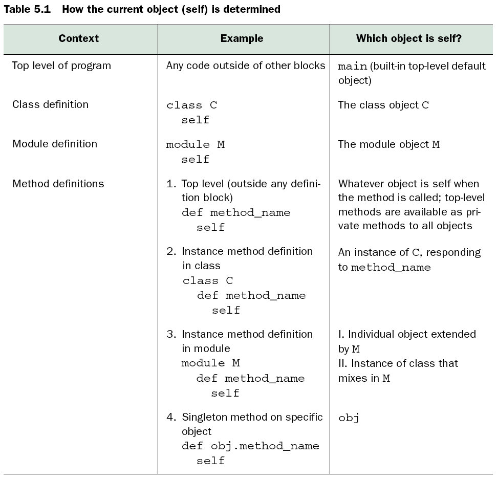

# Identity Crisis

* All Ruby programs suffer from multiple personality disorder
* `self` is the *default message receiver*

<!SLIDE image>

<!SLIDE image>

<!SLIDE console>
# `main`, the magic self

    $ ruby -e 'puts self'
    main

Methods defined inside main become *private* methods of *`Object`*

# `self` in class and module definitions

    @@@ ruby
    class C
      puts self    # "C"
      module M
        puts self  # "C::M"
      end
      puts self    # "C"
    end

# `self` during class methods definitions

* This allows the fun trick `def self.foo` to define class methods
* Easier to identify class methods, also easier to rename your class

# `self` in method definitions

* This is weird if you think about it too hard
* When the interpreter hits a `def`, it *defines* the method immediately but doesn't *execute* it until later
* When it's executed, `self` is pointing to the *instance* the method was called on

    class C
      def x
        puts self
      end
    end
    >> C.new.x
    #<C:0x0000010087e898>

