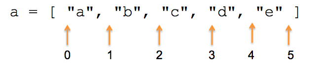

# Adding to an array

    @@@ ruby
    a = []

    a << "x"       #=> ["x"]
    a.push "y"     #=> ["x", "y"]
    a + "z"        #=> can't convert String into Array
    a + ["z"]      #=> ["x", "y", "z"]
    a.concat ["w"] #=> ["x", "y", "z", "w"]

* Note: "push" is destructive; "concat" makes a copy
* Why doesn't push end in a bang?

# Accessing array items

* Arrays are zero-indexed

        @@@ ruby
        fruit = ["apple", "banana", "cherry"]
        fruit[0] #=> "apple"
        fruit[2] #=> "cherry"
        fruit[3] #=> nil
        
# Zero > One

* Think of the index as pointing to the **space between** items

* This allows consistent length and looping semantics

# Fun with Array Indexes

    @@@ ruby
    fruit = ["apple", "banana", "cherry"]

* negative indexes count from the back

        @@@ ruby
        a[-1] #=> "cherry"
        
* range indexes

        @@@ ruby
        fruit[1..2]  #=> ["banana", "cherry"]
        fruit[1...3] #=> ["banana", "cherry"]

# Multidimensional arrays (aka matrices)

* No special matrix syntax
* Have to be built up "by hand" as arrays of arrays

        @@@ ruby
        times_table = []
        4.times do |x| 
          times_table[x] = []
          4.times do |y| 
            times_table[x][y] = x * y
          end
        end

        >> times_table
        => [[0, 0, 0, 0], [0, 1, 2, 3], [0, 2, 4, 6], [0, 3, 6, 9]]
        >> times_table[2][3]
        => 6
                

# Array vs. Hash

An array is an ordered list of values
A hash is an unordered set of key/value pairs

An array has an index that must be an integer
A hash has a key that can be any object (number, string, another hash, etc.)

Array is also called List, Vector
Hash is also called Map, Dictionary

# Hash#merge

# Hash#merge!

