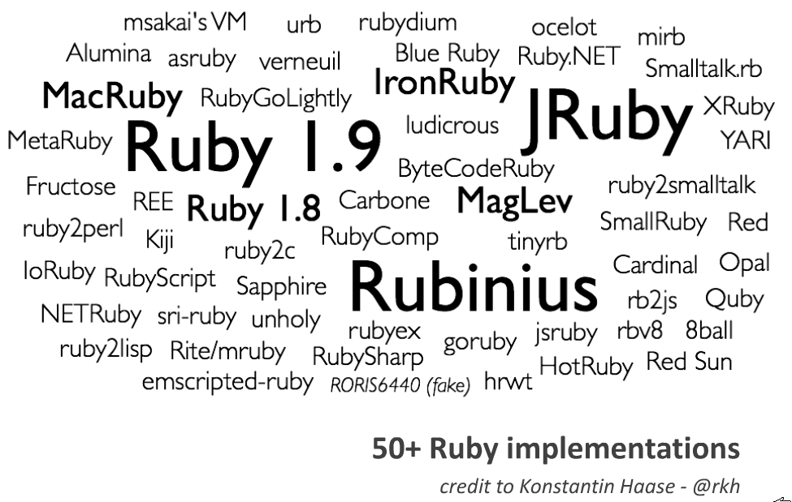

!SLIDE subsection
# Introduction to Ruby for Programmers

This section is intended as a brief, lightweight overview of the Ruby language; following sections will cover all these topics in much more detail. Students are encouraged to ask questions, but instructors are encouraged to answer, "We'll cover that later."

# Ruby vs. Rails

## Ruby is a Language

## Rails is a Framework

## Rails is written in Ruby

<!SLIDE subsection incremental>
# Ruby Philosophy

Q: Did you have a guiding philosophy when designing Ruby?

A: Yes, it's called the "principle of least surprise."

I believe people want to express themselves when they program.

They don't want to fight with the language.

Programming languages must feel natural to programmers.

I tried to make people enjoy programming and concentrate on the fun and creative part of programming when they use Ruby.

&nbsp;&nbsp;- [Matz](http://linuxdevcenter.com/pub/a/linux/2001/11/29/ruby.html) (Yukihiro Matsumoto), Ruby creator

# Ruby Philosophy: Humane Interface

* Ruby has a *humane interface*
  * many ways to do things
* Ruby favors readability and variety over concision and perfection
* sometimes makes code hard to understand (but usually makes it easier)
* contrast to *minimal interface*
  * one (or a few) "right" ways to do things
  * Python has a minimal philosophy

# Many Rubies

* Ruby 1.0 released in 1996
  * Fully Open Source

# Versions common today

* MRI 1.8.7
* MRI 1.9.2 or 1.9.3
* JRuby

# Ruby Language Overview

* Interpreted
* Dynamically typed
* Object oriented
* Blocks / lambdas / closures
* Perl-like regular expressions
* Closely tied to shell & OS

# IRB: Interactive RuBy

    @@@ ruby
    $ irb
    >> 4
    => 4
    >> 4+4
    => 8

Please fire up `irb` on your computer and try this out right now!

# Everything's an Object

    @@@ ruby
    >> 2.class
    => Fixnum
    
    >> 2.to_s
    => "2"

    >> 2.to_s.class
    => String

# Everything Has a Value

    @@@ ruby
    >> 2 + 2
    => 4

    >> (2+2).zero?
    => false

    >> if true then "yes" end
    => "yes"

    >> if false then "yes" end
    => nil

# Output vs Value

    >> puts "foo"
    foo
    => nil
    
The *output* is `foo\n` but the *value* is `nil`

# Blocks are like mini-functions

* Blocks can also take parameters or return a value
* e.g. the `map` iterator translates each item in an array into a new array

        @@@ ruby
        >> ["hello", "world"].map {|string| string.upcase}
        => ["HELLO", "WORLD"]

* `{|string| string.upcase}` defines a block

# Method Chaining

* Chaining is a *really* cool and powerful Ruby idiom
* It depends on these three features:
  * Every expression has a value
  * Every value is an object
  * Iterators are loops inside methods

# Method Chaining Example

    s = "my dog has fleas"

Without chaining:

    words = s.split
    words = words.map{|word| word.capitalize}
    s = words.join(" ")

With chaining:

    s = "my dog has fleas"
    s.split.map{|word| word.capitalize}.join(" ")

# Optional Punctuation

* semicolons, parens, and `return` are optional

* These are equivalent:

        @@@ ruby
        def inc(x)
          return x + 1;
        end

        def inc x
          x + 1
        end

        def inc(x); x + 1; end

        def inc(x) x + 1; end

# Line Break Gotcha

    @@@ ruby
    x = 1 + 2
    x #=> 3

    x = 1
      + 2
    x #=> 1

Solution: always put operators on top line

    x = 1 +
        2
    x #=> 3

# Use parens when you need them

    @@@ ruby
    >> "Hello".gsub "H", "h"
    => "hello"

    >> "Hello".gsub "H", "h".reverse
    => "hello"

    >> "Hello".gsub("H", "h").reverse
    => "olleh"

# Ruby has hash comments, like perl

    @@@ ruby
    # is a comment
    2 + 2 # is a comment

Ruby has a syntax for multiline comments too, but it's silly and nobody uses it.

!SLIDE
# Variables are declared implicitly

    @@@ ruby
    first_name = "Santa"
    last_name = "Claus"
    full_name = first_name + last_name
    #=> "SantaClaus"

!SLIDE custom
# Built-in Types

* Numbers
  * `42` (Fixnum)
  * `3.14159` (Float)
* Booleans
  * `true`
  * `false`
* Strings
  * `"apple"`
  * `'banana'`
* Symbols
  * `:apple`

# Built-in Types (cont.)

* Regular Expressions
  * `/fo*/i`
* Arrays
  * `["apple", "banana"]`
* Ranges
  * `(1..10)`
* Hashes
  * `{:apple => 'red', :banana => 'yellow'}`
  * `{apple: 'red', banana: 'yellow'}`

# String interpolation

    @@@ ruby
    "boyz #{1 + 1} men"
    => "boyz 2 men"

* Any Ruby code can go inside the braces
* It gets evaluated and stuck inside the string

# equal, double-equal, and threequal

* `x = 1` means "put the value `1` in the variable `x`"
* `x == 2` means "`true` if `x` is `2`, otherwise `false`"
* `x === 3` means the same as `==` but sometimes more
  * threequal is rarely used

# Ruby syntax cheatsheet

(_The Well-Grounded Rubyist_, p. 5, section 1.1.2)

# Functions

    @@@ ruby
    def add a, b
      a + b
    end

    add 2, 2
    #=> 4

* Note: no 'return' required
* `def add(a, b)` is also legal

# Interlude

Are you sick of hearing me speak?

If so, do a lab: 01_temperature is right up your alley.

# Classes and methods

    @@@ ruby
    class Calculator
      def add(a,b)
        a + b
      end
    end

    calc = Calculator.new
    calc.add(2, 2)
    #=> 4

* a *function* inside a *class* is called a *method*

# Classes

* A class defines a group of behaviors (methods)
* Every object has a class, `Object` if nothing else

# Messages and Methods

* an object is referenced by a variable or a literal
* the dot operator (`.`) sends a message to an object
* an object receives a *message* and invokes a *method*
* with no dot, the default object (`self`) is the receiver

# bang and question mark methods

* method names can end with `!` or `?`
  * `?` means "boolean"
  * `!` means "watch out!"

# Ruby Naming Conventions

methods and variables are in `snake_case`

classes and modules are in `CamelCase`

constants are in `ALL_CAPS`

> Standard is better than better.
>
> -- Anon.

# Ruby Identifiers

* `local_variable` - start with letter or underscore, contain letters, numbers, underscored
* `@instance_variable` - start with `@`
* `@@class_variable` - start with `@@`
* `$global_variable` - start with `$`
* `Constant` or `CONSTANT` - must start with uppercase letter
* `ClassName` - capitalized camel case
* `method_name?` - like a local variable, but can end with `?` or `!` or `=`
* keywords - about 40 reserved words (`def`) and weirdos (`__FILE__`)
* literals - `"hi"` for strings, `[1,2]` for arrays, `{:a=>1, :b=>2}` for hashes, etc.

# Variable Scopes

    @@@ ruby
    var   # local variable (or method call)
    @var  # instance variable
    @@var # class variable
    $var  # global variable
    VAR   # constant

# `load` and `require`

* `load` inserts a file's contents into the current file
* `require` makes a *feature* available to the current file
  * skips already-loaded files
  * omits the trailing `.rb`
  * can also be used for extensions written in C (`.so`, `.dll`, etc.)

# Credits

* "Ruby Intro" slides based on [Ruby Quickstart for Refugees](https://gist.github.com/190567) by [Jacob Rothstein](http://about.me/jbr)
* Improved by Alex Chaffee, Sarah Allen, Wolfram Arnold

