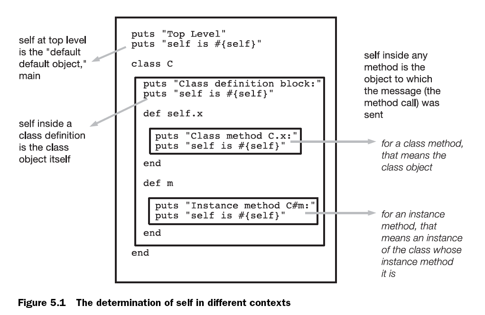

<!SLIDE subsection>
# Self

Ref.: WGR Ch. 5, The default object (self), scope, and visibility

<!SLIDE subsection>
# Who Am I?

* All Ruby programs suffer from multiple personality disorder
* `self` always points to the *current object*
* `self` is the *default message receiver*

<!SLIDE image>

<!SLIDE image>

# `self` in methods

* This is only weird if you think about it too hard
* When the interpreter hits a `def`, it *defines* the method immediately but doesn't *execute* it until later
* When it's executed, `self` is pointing to the *instance* the method was called on

        @@@ ruby
        class C
          def x
            puts self
          end
        end

        >> C.new.x
        #<C:0x0000010087e898>

# `self` as the default message receiver

If Ruby can't find a variable or function with the right name, it tries to dispatch it to self.

    @@@ ruby
    class C
      def x
        puts "x"
      end
      
      def y
        puts "y"
        self.x   # << same
        x        # << thing
      end
    end

# `main`, the magic self

    $ ruby -e 'puts self'
    main

Methods defined inside main become *private* methods of *`Object`*

# `self` in class and module definitions

    @@@ ruby
    class C
      puts self    # "C"
      module M
        puts self  # "C::M"
      end
      puts self    # "C"
    end

# `self` during class method definitions

* This allows the fun trick `def self.foo` to define class methods
* Easier to identify class methods, also easier to rename your class

# The setter gotcha

* Inside an object, you can't call that object's setter methods directly
* Why not?
  * Because "`age = 2`" looks like a *local variable* assignment, which takes precedence
  * It _eclipses_ the setter method!
  * Syntax ambiguity! Oh noes!
* Solution: use "`self.age = 2`"

# An Elegant Object, using implicit self

    @@@ruby
    class Student
      attr_accessor :first_name, :middle_name, :last_name

      def initialize first_name, middle_name, last_name
        @first_name, @middle_name, @last_name = 
          first_name, middle_name, last_name
      end
  
      def name        
        name = "" 
        name << first_name
        name << " #{middle_name}" if middle_name
        name << " #{last_name}"   # returns name
      end
    end

# Digging into the name method

    @@@ruby
    >> Student.new("alex", "day", "chaffee").name
    => "alex day chaffee"
    
    >> Student.new("alex", "", "chaffee").name
    => "alex  chaffee"
    
    >> Student.new("alex", nil, "chaffee").name
    => "alex chaffee"
